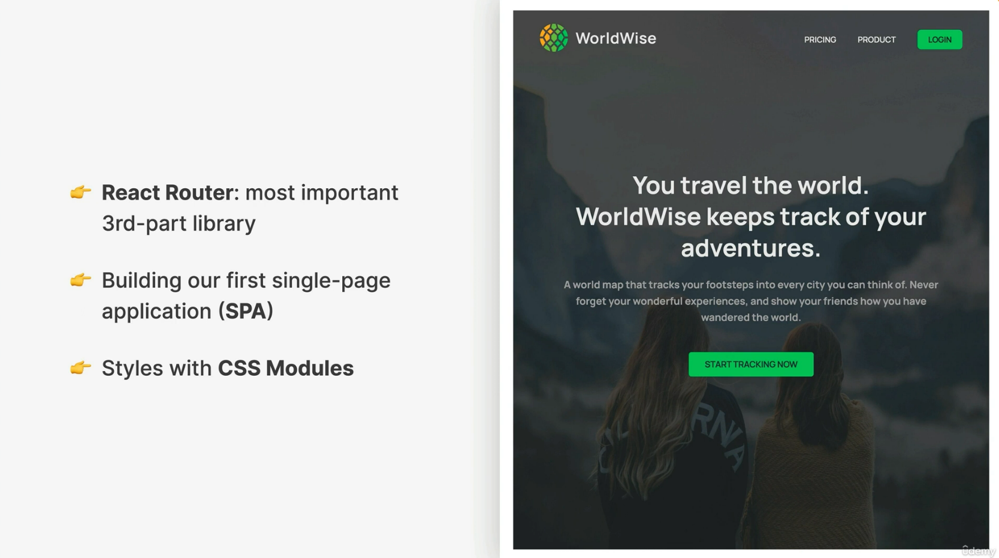
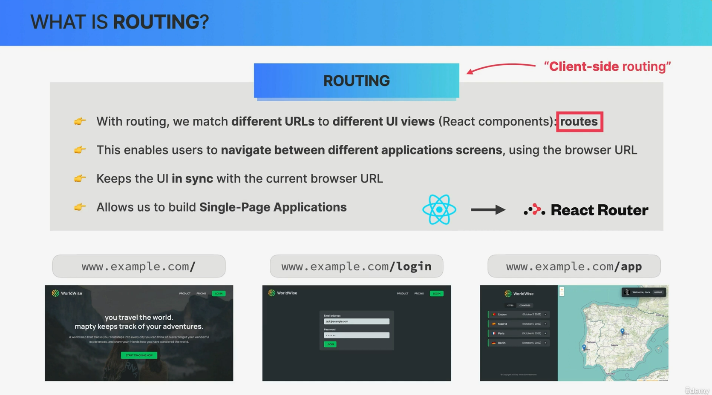
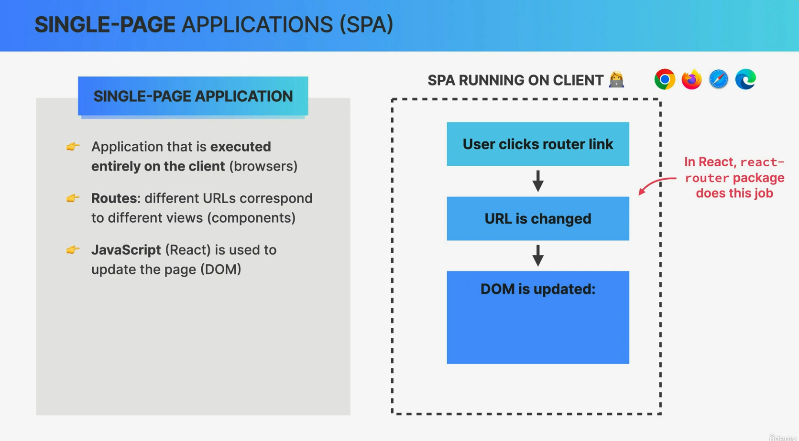
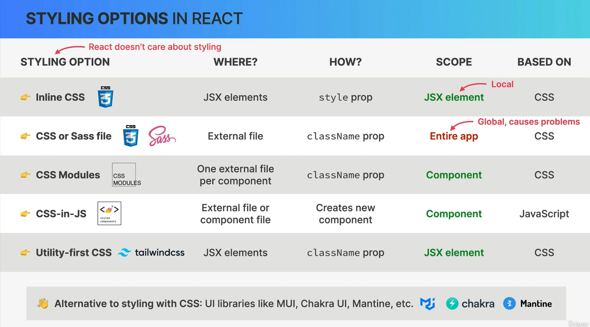
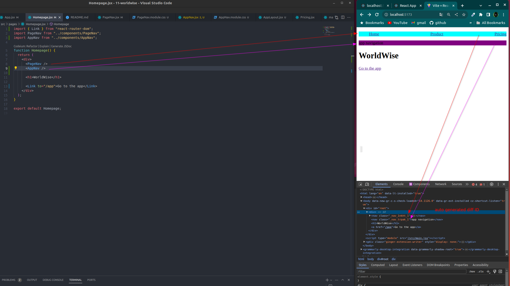
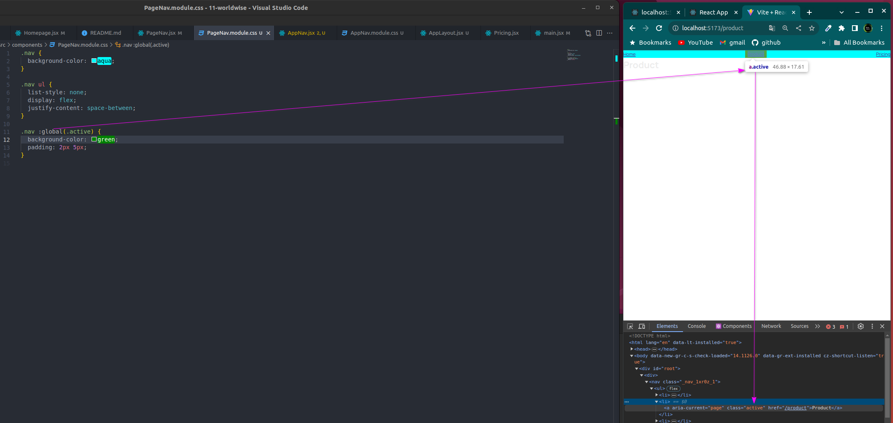
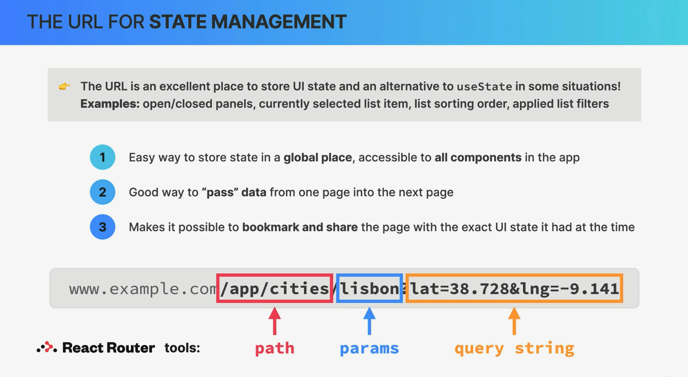
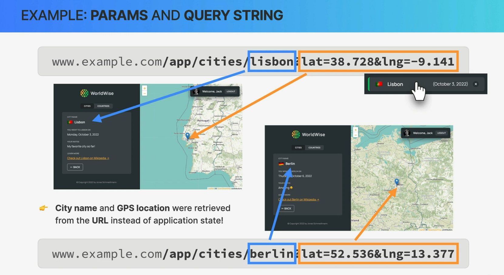

# what is routing in react?






Routing in React refers to the process of managing and handling different URLs (or routes) within a web application. It involves determining how the application should respond to different URLs requested by the user and rendering the appropriate content or components based on those routes. Routing allows you to create multi-page web applications where each page or view corresponds to a different URL.

Key aspects of routing in React include:

1. **URL Handling**: Routing libraries or components in React help you define the URLs (routes) that your application should respond to. These routes are typically associated with specific components or views.

2. **Navigation**: Routing enables users to navigate between different views or pages of your application by clicking links, buttons, or other user interface elements. Navigation can be handled programmatically or through user interactions.

3. **Dynamic Content**: Routing allows you to load different content or components based on the route. This is useful for creating single-page applications (SPAs) where the URL changes, but the page doesn't fully reload, providing a smoother user experience.

4. **Route Parameters**: React routing libraries often support route parameters, allowing you to capture dynamic values from the URL and pass them as props to the rendered components. This is useful for building dynamic and data-driven views.

5. **Nested Routes**: You can define nested routes, where a parent route contains child routes. This is helpful for structuring complex applications with multiple sections or views.

6. **Redirects**: Routing libraries provide mechanisms for redirecting users from one route to another. This is useful for handling scenarios like authentication or ensuring that users are directed to the correct page.

7. **Error Handling**: You can implement error handling for routes that don't exist or for unexpected errors that occur during navigation. This typically involves displaying a "Not Found" page or handling errors gracefully.

8. **History Management**: Routing libraries often provide tools for managing the browser's navigation history, allowing users to use the browser's back and forward buttons to navigate between routes.

In React, one of the most commonly used libraries for handling routing is React Router. React Router is a powerful and flexible library that provides components and utilities for defining and managing routes in React applications. It allows you to create a structured navigation system that makes it easy to build single-page applications with multiple views.

Here's a simplified example of how routing might look in a React application using React Router:

```jsx
import React from "react";
import { BrowserRouter as Router, Route, Switch } from "react-router-dom";

function App() {
  return (
    <Router>
      <Switch>
        <Route path="/" exact component={Home} />
        <Route path="/about" component={About} />
        <Route path="/contact" component={Contact} />
        <Route component={NotFound} />
      </Switch>
    </Router>
  );
}
```

In this example, different routes are defined, and each route is associated with a specific component. When a user navigates to a URL matching one of these routes, the corresponding component is rendered.

Overall, routing in React is essential for creating dynamic and interactive web applications with multiple views and URLs, making it easier for users to navigate through the application's content.

## SPA stands for "Single Page Application."



SPA stands for "Single Page Application." It is a type of web application or website that loads a single HTML page and dynamically updates the content as the user interacts with the application. Unlike traditional multi-page applications (MPAs), where each user action typically triggers a full page reload from the server, SPAs aim to provide a more seamless and responsive user experience by fetching data and rendering content without full page refreshes.

Key characteristics and concepts of SPAs include:

1. **Single HTML Page**: SPAs start by loading a single HTML page that contains the initial structure and assets (such as JavaScript and CSS files) required for the application.

2. **Client-Side Routing**: SPAs handle routing on the client side, using JavaScript frameworks and libraries like React, Angular, or Vue.js. This means that different views or "pages" within the application are managed without requesting new HTML pages from the server.

3. **Dynamic Updates**: As users interact with the SPA, content is dynamically updated by fetching data from APIs or services and rendering it within the existing page structure. This results in a smoother and more responsive user experience.

4. **AJAX and API Requests**: SPAs rely heavily on asynchronous requests (often using AJAX or Fetch API) to communicate with the server and retrieve data or perform actions without page reloads.

5. **State Management**: SPAs often use client-side state management solutions, such as Redux (for React) or Vuex (for Vue.js), to manage application state and ensure data consistency.

6. **URL Handling**: SPAs use client-side routing to update the URL as users navigate through different views. This allows users to bookmark and share specific application states.

7. **Performance Optimization**: SPAs can optimize performance by loading only the required assets and data when needed. They may also implement techniques like lazy loading to minimize initial load times.

8. **SEO Considerations**: SEO (Search Engine Optimization) can be a challenge for SPAs since search engine crawlers traditionally rely on server-rendered content. However, modern SPAs can implement server-side rendering (SSR) or use techniques like prerendering to improve SEO.

9. **Back and Forward Navigation**: SPAs often include support for browser navigation using the back and forward buttons. This is typically achieved using the HTML5 History API.

10. **User Experience**: SPAs aim to provide a more app-like user experience by minimizing disruptions caused by full page reloads. This makes them suitable for web applications, online tools, dashboards, and interactive websites.

Popular JavaScript frameworks and libraries like React, Angular, and Vue.js have enabled the development of SPAs by providing tools and abstractions for building dynamic and responsive user interfaces.

While SPAs offer advantages in terms of user experience and interactivity, they also introduce complexities in terms of initial load times, SEO, and state management. The choice to build a SPA depends on the specific requirements of your application and the trade-offs you are willing to make. In some cases, a hybrid approach combining SPAs with server-side rendering (SSR) or static site generation (SSG) may be considered for improved performance and SEO.

# use React Router

Certainly! Here are some examples of how to use React Router version 6 to define routes and handle navigation in a React application:

**1. Basic Routing**:

To get started, you can define basic routes for different views or components in your application.

```jsx
import { BrowserRouter, Route, Routes } from "react-router-dom";

function App() {
  return (
    <BrowserRouter>
      <Routes>
        <Route path="/" element={<Home />} />
        <Route path="/about" element={<About />} />
        <Route path="/contact" element={<Contact />} />
      </Routes>
    </BrowserRouter>
  );
}
```

In this example, when the URL matches `/`, the `Home` component is rendered. Similarly, `/about` renders the `About` component, and `/contact` renders the `Contact` component.

**2. Route Parameters**:

You can capture dynamic values from the URL using route parameters. For example, a route to display user profiles with user IDs:

```jsx
<Route path="/user/:id" element={<UserProfile />} />
```

Inside the `UserProfile` component, you can access the `id` parameter via React Router's `useParams` hook or the `params` prop.

**3. Nested Routes**:

Nested routes are useful for organizing complex layouts. You can nest routes within other routes, creating a hierarchy of views.

```jsx
<Route path="/products" element={<Products />}>
  <Route index element={<ProductsList />} />
  <Route path=":id" element={<ProductDetail />} />
</Route>
```

In this example, the `Products` component is the parent route, and it has two nested routes: one for displaying a list of products (`ProductsList`) and another for displaying the details of a specific product (`ProductDetail`).

**4. Programmatic Navigation**:

You can programmatically navigate to different routes using the `useNavigate` hook or the `navigate` function.

```jsx
import { useNavigate } from "react-router-dom";

function MyComponent() {
  const navigate = useNavigate();

  const handleClick = () => {
    // Navigate to the '/about' route
    navigate("/about");
  };

  return (
    <div>
      <button onClick={handleClick}>Go to About</button>
    </div>
  );
}
```

**5. Linking**:

Use the `Link` component for creating navigation links within your application. When users click on links, React Router handles the navigation without a full page reload.

```jsx
import { Link } from "react-router-dom";

function Navigation() {
  return (
    <nav>
      <ul>
        <li>
          <Link to="/">Home</Link>
        </li>
        <li>
          <Link to="/about">About</Link>
        </li>
        <li>
          <Link to="/contact">Contact</Link>
        </li>
      </ul>
    </nav>
  );
}
```

These are some basic examples of how to use React Router version 6 for routing and navigation in your React application. React Router offers more advanced features for route guarding, redirects, query parameters, and error handling, which you can explore based on the specific needs of your application.

# Link vs NavLink

In React Router, both `Link` and `NavLink` components are used for creating navigation links within your application. They are similar in many ways but have a key difference related to styling and active link highlighting. Here's an overview of both components:

**1. Link**:

The `Link` component is the most basic way to create navigation links in React Router. It allows you to specify the target route using the `to` prop. When a user clicks on a `Link`, React Router handles the navigation by changing the URL without a full page refresh.

```jsx
import { Link } from "react-router-dom";

function Navigation() {
  return (
    <nav>
      <ul>
        <li>
          <Link to="/">Home</Link>
        </li>
        <li>
          <Link to="/about">About</Link>
        </li>
        <li>
          <Link to="/contact">Contact</Link>
        </li>
      </ul>
    </nav>
  );
}
```

Key points about `Link`:

- Provides basic navigation functionality.
- Does not include any additional styling or props for handling the "active" state of the link (i.e., the link to the currently active route).

**2. NavLink**:

The `NavLink` component, on the other hand, is an extension of `Link` with added features for styling and managing the "active" state of the link. It allows you to apply specific styles to the link when it matches the current route.

```jsx
import { NavLink } from "react-router-dom";

function Navigation() {
  return (
    <nav>
      <ul>
        <li>
          <NavLink to="/" exact activeClassName="active">
            Home
          </NavLink>
        </li>
        <li>
          <NavLink to="/about" activeClassName="active">
            About
          </NavLink>
        </li>
        <li>
          <NavLink to="/contact" activeClassName="active">
            Contact
          </NavLink>
        </li>
      </ul>
    </nav>
  );
}
```

Key points about `NavLink`:

- Inherits all the functionality of `Link` for navigation.
- Allows you to add the `activeClassName` prop, which specifies the CSS class to apply when the link is active (i.e., when the current route matches the link's `to` prop).
- Provides other props like `activeStyle` and `isActive` for more advanced styling and customization.

**Choosing Between `Link` and `NavLink`**:

- Use `Link` when you need basic navigation functionality without any specific styling or active link highlighting.
- Use `NavLink` when you want to style the active link differently or perform more advanced styling based on the current route.

In most cases, when you want to highlight the active link in your navigation menu or apply specific styles to the current route, `NavLink` is the preferred choice. However, if you don't need these features, `Link` is sufficient for creating navigation links.

# styling options in react



Styling options in React applications can vary depending on your preferences, project requirements, and the libraries or tools you choose to use. Here are several common ways to style React components:

1. **Inline Styles**:

   You can apply styles directly to React components using inline styles. Inline styles are defined as JavaScript objects where the keys are CSS property names in camelCase, and the values are the corresponding CSS values. These styles are applied as HTML `style` attributes.

   ```jsx
   const styles = {
     backgroundColor: "blue",
     color: "white",
     fontSize: "16px",
   };

   function MyComponent() {
     return <div style={styles}>Styled Content</div>;
   }
   ```

   Inline styles are useful for component-specific styling but can become cumbersome for complex styles.

2. **CSS Stylesheets**:

   You can use traditional CSS stylesheets to style React components. Simply import the CSS file into your component or application, and apply class names to your elements.

   ```jsx
   import "./MyComponent.css";

   function MyComponent() {
     return <div className="my-component">Styled Content</div>;
   }
   ```

   This approach is great for maintaining separation between your HTML structure and styles.

3. **CSS Modules**:

   CSS Modules are a way to locally scope CSS styles in your React components. When you import a CSS Module, it provides an object with class names as properties, which you can use to style your elements.

   ```jsx
   import styles from "./MyComponent.module.css";

   function MyComponent() {
     return <div className={styles.myComponent}>Styled Content</div>;
   }
   ```

   CSS Modules offer component-level scoping, preventing style conflicts.

4. **Styled Components**:

   Styled Components is a popular CSS-in-JS library for React. It allows you to write CSS directly within your JavaScript or TypeScript files using tagged template literals. Styled Components generate unique class names and encapsulate styles by default.

   ```jsx
   import styled from "styled-components";

   const StyledDiv = styled.div`
     background-color: blue;
     color: white;
     font-size: 16px;
   `;

   function MyComponent() {
     return <StyledDiv>Styled Content</StyledDiv>;
   }
   ```

   Styled Components offer a powerful way to create component-specific styles with full access to JavaScript logic.

5. **CSS-in-JS Libraries**:

   In addition to Styled Components, there are other CSS-in-JS libraries like Emotion and JSS that provide similar capabilities for styling React components.

6. **CSS-in-JS with Utility Classes**:

   Some libraries like Tailwind CSS offer utility classes that you can apply directly to your JSX elements. This approach allows you to rapidly build and style components using pre-defined CSS classes.

   ```jsx
   function MyComponent() {
     return (
       <div className="bg-blue-500 text-white text-lg">Styled Content</div>
     );
   }
   ```

7. **CSS Preprocessors**:

   You can use CSS preprocessors like Sass or Less to write more maintainable and organized CSS. These preprocessors can be integrated into your React project's build process.

8. **CSS-in-JS with Theming**:

   CSS-in-JS libraries often support theming, allowing you to dynamically change styles based on a theme or user preferences.

Choose the styling approach that best fits your project's needs and your team's preferences. React is flexible and can work seamlessly with various styling techniques and tools.

## Using CSS Modules





CSS Modules are a popular way to locally scope CSS styles in your React components, preventing style conflicts and providing a component-centric approach to styling. Here's how to use CSS Modules in a React application:

**1. Setup**:

First, ensure that your project supports CSS Modules. Most modern React build tools like Create React App (CRA) and Webpack offer built-in support for CSS Modules. If you're not using such tools, you might need to configure your build system to handle CSS Modules.

**2. Naming Convention**:

In CSS Modules, class names are automatically scoped to the component that imports them. This means you don't need to worry about name clashes or global CSS pollution. Class names often follow the convention of being camelCase.

**3. Create a CSS Module File**:

Create a CSS file with the `.module.css` extension. For example, `MyComponent.module.css`. This naming convention tells your build tool to treat the file as a CSS Module.

```css
/* MyComponent.module.css */

.myComponent {
  background-color: blue;
  color: white;
  font-size: 16px;
}
```

**4. Import and Use CSS Module in React Component**:

Import the CSS Module and use the class names as properties of the imported object.

```jsx
import React from "react";
import styles from "./MyComponent.module.css";

function MyComponent() {
  return <div className={styles.myComponent}>Styled Content</div>;
}

export default MyComponent;
```

In this example, `styles.myComponent` is a dynamically generated class name that corresponds to the `myComponent` class defined in `MyComponent.module.css`. This class name is unique to the scope of this component and won't interfere with other components.

**5. Using Multiple Class Names**:

You can use multiple class names and apply conditional styles in the same way:

```jsx
import React from "react";
import styles from "./MyComponent.module.css";

function MyComponent() {
  const isActive = true;

  return (
    <div className={`${styles.myComponent} ${isActive ? styles.active : ""}`}>
      Styled Content
    </div>
  );
}

export default MyComponent;
```

**6. Dynamic Class Names**:

You can also use dynamic class names based on component props or state:

```jsx
import React from "react";
import styles from "./MyComponent.module.css";

function MyComponent({ isHighlighted }) {
  return (
    <div
      className={`${styles.myComponent} ${
        isHighlighted ? styles.highlighted : ""
      }`}
    >
      Styled Content
    </div>
  );
}

export default MyComponent;
```

**7. Pseudo-selectors and Media Queries**:

CSS Modules can handle pseudo-selectors and media queries just like regular CSS. You can define them in your `.module.css` file as needed.

```css
/* MyComponent.module.css */

.myComponent {
  background-color: blue;
  color: white;
  font-size: 16px;
}

.myComponent:hover {
  background-color: lightblue;
}

@media (max-width: 768px) {
  .myComponent {
    font-size: 14px;
  }
}
```

Using CSS Modules makes it easy to manage styles for individual components, keeps your CSS organized, and helps prevent naming conflicts in your React application.

# Using the URL for state management





Using the URL for state management in a React application is a common approach, particularly when you want to make certain parts of your application's state shareable via URLs. This approach is often referred to as "URL parameters" or "routing with URL parameters." Here's what, when, and why you might use this technique:

**What**:

URL-based state management involves encoding specific pieces of application state within the URL. This typically includes parameters or segments in the URL that represent different parts of your application's state.

**When**:

1. **Bookmarkable and Shareable Links**: When you want users to be able to bookmark and share specific states or views of your application. For example, in an e-commerce application, you might want to share a product page's URL with all the necessary product details encoded in the URL.

2. **Maintaining Navigation History**: When you want users to be able to use the browser's back and forward buttons to navigate through different states of your application. URL-based state management allows you to synchronize the application state with the URL, making it possible to go back and forth in the user's session.

3. **Revisiting a Specific State**: When you want to allow users to revisit a specific state or view by simply entering the URL. This is commonly used in web applications where users need to return to specific views or documents frequently.

**Why**:

1. **Improved User Experience**: URL-based state management enhances the user experience by providing a consistent way to bookmark, share, and navigate through the application. Users appreciate the ability to return to a particular state easily.

2. **Search Engine Optimization (SEO)**: When URL parameters are used sensibly, they can improve the discoverability of specific content by search engines. This can positively impact your application's SEO.

3. **Back Button Support**: URL-based state management ensures that users can use the browser's back and forward buttons without losing context. This is crucial for maintaining a seamless user experience.

4. **Deep Linking**: It allows deep linking into your application, meaning that users can directly access a specific state or view by clicking on a link. This is beneficial for marketing and user onboarding.

5. **Storing User Input or Filters**: You can encode user input, filters, or query parameters in the URL. For example, in an e-commerce site, you might encode search filters in the URL so that users can share specific search results.

**Example**:

Suppose you have an e-commerce application, and you want to encode the selected category and search query in the URL. Your URL might look like this:

```
https://example.com/products?category=electronics&search=laptops
```

In this URL, "category" and "search" are URL parameters that represent specific pieces of application state (selected category and search query). When users visit this URL, your React application can parse these parameters and use them to fetch the appropriate data and display the corresponding view.

To implement URL-based state management in a React application, you can use libraries like React Router, which provide a way to define routes, extract URL parameters, and update the URL based on changes in the application state.

## State management in React

State management in React involves managing and sharing data across components efficiently. There isn't a specific URL for state management in React, but I can provide you with an overview of common state management techniques and libraries used in React:

1. **React State**:

   - React's built-in state management allows you to manage component-level state using the `useState` hook or the `this.state` approach in class components.
   - It's suitable for simple state management within individual components but can become challenging for complex applications with shared or global state.

2. **React Context API**:

   - The React Context API provides a way to share data across components without prop drilling.
   - It allows you to create a context object, provide it at a higher level in the component tree, and consume it in lower-level components.
   - Context can be used for both local and global state management.

3. **Redux**:

   - Redux is a popular state management library for managing complex application state in React applications.
   - It centralizes the application's state in a single store, and components can interact with the store using actions and reducers.
   - Redux is particularly useful for large-scale applications with a lot of shared state.

4. **Mobx**:

   - Mobx is another state management library that uses observable data structures to manage and reactively update state.
   - It provides a more flexible and intuitive way to manage state compared to Redux.
   - Mobx is often chosen for its simplicity and ease of use.

5. **Recoil**:

   - Recoil is a state management library developed by Facebook for managing state in React applications.
   - It offers features like atom (storing state), selectors (derived state), and more.
   - Recoil is designed to be flexible and scalable for various state management needs.

6. **Zustand**:

   - Zustand is a lightweight state management library for React that provides a simple API for creating and consuming state.
   - It uses hooks and a store pattern to manage state in a component.
   - Zustand is known for its simplicity and minimalism.

7. **RxJS**:

   - RxJS is a library for reactive programming that can be used for more advanced state management scenarios.
   - It's particularly useful when dealing with asynchronous data streams and complex event handling.

8. **GraphQL**:

   - GraphQL, when used with a state management library like Apollo Client, can efficiently manage and fetch data from a server and share it across components.
   - It's commonly used in modern web applications to fetch and update data.

9. **Custom Hooks**:
   - React allows you to create custom hooks to encapsulate and reuse stateful logic across components.
   - Custom hooks can be a powerful way to manage state and behavior in a reusable manner.

The choice of state management technique or library depends on the specific requirements of your application. Simple applications may benefit from React's built-in state or the Context API, while larger and more complex applications may require more robust solutions like Redux or Mobx.

# useSearchParams

The `useSearchParams` hook is part of the React Router library (version 6 and later) and is used for reading and manipulating URL query parameters in your React components. It provides a way to access and modify the query parameters in the URL, which can be useful for various purposes, such as filtering data, controlling the behavior of components, or sharing links with specific configurations.

Here's an example of how to use `useSearchParams`:

```jsx
import { useSearchParams } from "react-router-dom";

function ProductList() {
  const [searchParams, setSearchParams] = useSearchParams();

  // Read query parameters from the URL
  const category = searchParams.get("category");
  const minPrice = searchParams.get("minPrice");
  const maxPrice = searchParams.get("maxPrice");

  // Function to update query parameters
  const updateSearchParams = (newParams) => {
    setSearchParams((prevParams) => ({
      ...prevParams,
      ...newParams,
    }));
  };

  // Function to handle filtering based on query parameters
  const handleFilter = () => {
    // Fetch products based on the selected filters
    // (e.g., category, minPrice, maxPrice)
  };

  return (
    <div>
      <h1>Product List</h1>
      <label>Category:</label>
      <input
        type="text"
        value={category || ""}
        onChange={(e) => updateSearchParams({ category: e.target.value })}
      />
      <label>Min Price:</label>
      <input
        type="number"
        value={minPrice || ""}
        onChange={(e) => updateSearchParams({ minPrice: e.target.value })}
      />
      <label>Max Price:</label>
      <input
        type="number"
        value={maxPrice || ""}
        onChange={(e) => updateSearchParams({ maxPrice: e.target.value })}
      />
      <button onClick={handleFilter}>Apply Filters</button>
    </div>
  );
}

export default ProductList;
```

In this example:

- We import and use the `useSearchParams` hook to access and update the URL query parameters.

- We read the query parameters (e.g., `category`, `minPrice`, `maxPrice`) from `searchParams` using the `get` method.

- We define an `updateSearchParams` function to update the query parameters. It takes an object with new parameters and merges them with the existing ones.

- The input fields for category, minPrice, and maxPrice allow users to modify the query parameters, and when the user interacts with these inputs, the URL updates accordingly.

- The "Apply Filters" button triggers the `handleFilter` function, which can fetch products based on the selected filters.

Here's anpther example of using the `useSearchParams` hook to manage and display a user's name from a query parameter in the URL:

```jsx
import React, { useState } from "react";
import { useSearchParams } from "react-router-dom";

function UserProfile() {
  const [searchParams] = useSearchParams();
  const userName = searchParams.get("name");
  const [inputName, setInputName] = useState(userName || "");

  // Function to update the 'name' query parameter
  const updateNameInURL = () => {
    searchParams.set("name", inputName);
  };

  return (
    <div>
      <h1>User Profile</h1>
      <label>Enter your name:</label>
      <input
        type="text"
        value={inputName}
        onChange={(e) => setInputName(e.target.value)}
      />
      <button onClick={updateNameInURL}>Update Name</button>
      {userName && <p>Hello, {userName}!</p>}
    </div>
  );
}

export default UserProfile;
```

In this example:

- We import the `useSearchParams` hook from `react-router-dom`.

- We use `useSearchParams` to access the URL's query parameters, specifically the 'name' parameter.

- The input field allows the user to enter their name. We use `inputName` to manage the input's value.

- When the user clicks the "Update Name" button, we call the `updateNameInURL` function to update the 'name' query parameter in the URL with the current value of `inputName`.

- Finally, we display a greeting message with the user's name if the 'name' query parameter is present in the URL.

This example demonstrates a basic use case where the URL query parameter ('name') is used to display personalized content based on user input. Users can update their name, and the URL reflects the changes.

**When to Use**:

You can use `useSearchParams` whenever you need to interact with URL query parameters in your React application. Some common use cases include:

1. Implementing search and filtering functionality in your application.

2. Allowing users to share specific views or filtered data by generating shareable URLs.

3. Creating dynamic routing behavior based on query parameters.

4. Storing and restoring application state within the URL for deep linking and navigation history.

5. Implementing SEO-friendly URLs with query parameters for better search engine indexing.

By using `useSearchParams`, you can easily read, update, and synchronize query parameters with your application's state, making it a valuable tool for managing URL-based state.

# React + Vite

This template provides a minimal setup to get React working in Vite with HMR and some ESLint rules.

Currently, two official plugins are available:

- [@vitejs/plugin-react](https://github.com/vitejs/vite-plugin-react/blob/main/packages/plugin-react/README.md) uses [Babel](https://babeljs.io/) for Fast Refresh
- [@vitejs/plugin-react-swc](https://github.com/vitejs/vite-plugin-react-swc) uses [SWC](https://swc.rs/) for Fast Refresh
