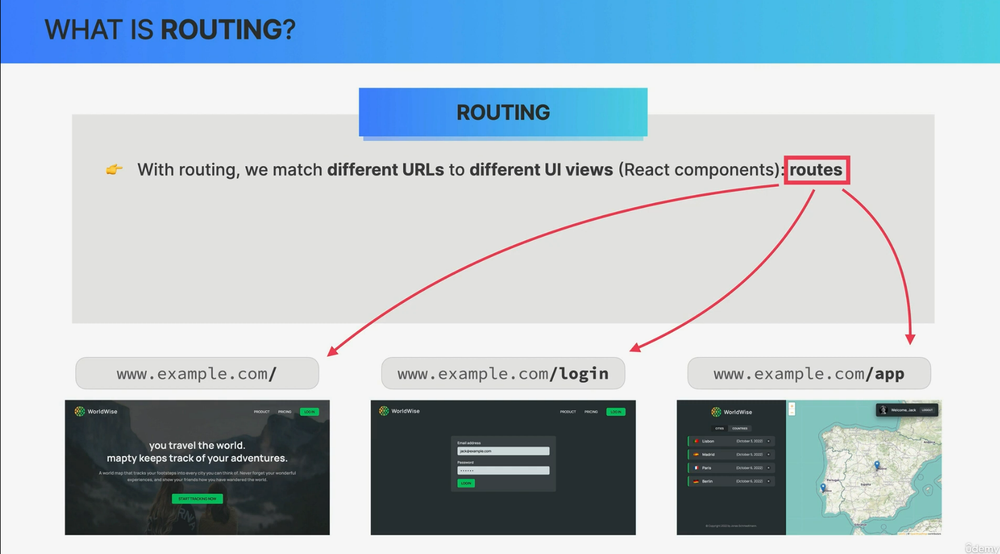

# what is routing in react?





Routing in React refers to the process of managing and handling different URLs (or routes) within a web application. It involves determining how the application should respond to different URLs requested by the user and rendering the appropriate content or components based on those routes. Routing allows you to create multi-page web applications where each page or view corresponds to a different URL.

Key aspects of routing in React include:

1. **URL Handling**: Routing libraries or components in React help you define the URLs (routes) that your application should respond to. These routes are typically associated with specific components or views.

2. **Navigation**: Routing enables users to navigate between different views or pages of your application by clicking links, buttons, or other user interface elements. Navigation can be handled programmatically or through user interactions.

3. **Dynamic Content**: Routing allows you to load different content or components based on the route. This is useful for creating single-page applications (SPAs) where the URL changes, but the page doesn't fully reload, providing a smoother user experience.

4. **Route Parameters**: React routing libraries often support route parameters, allowing you to capture dynamic values from the URL and pass them as props to the rendered components. This is useful for building dynamic and data-driven views.

5. **Nested Routes**: You can define nested routes, where a parent route contains child routes. This is helpful for structuring complex applications with multiple sections or views.

6. **Redirects**: Routing libraries provide mechanisms for redirecting users from one route to another. This is useful for handling scenarios like authentication or ensuring that users are directed to the correct page.

7. **Error Handling**: You can implement error handling for routes that don't exist or for unexpected errors that occur during navigation. This typically involves displaying a "Not Found" page or handling errors gracefully.

8. **History Management**: Routing libraries often provide tools for managing the browser's navigation history, allowing users to use the browser's back and forward buttons to navigate between routes.

In React, one of the most commonly used libraries for handling routing is React Router. React Router is a powerful and flexible library that provides components and utilities for defining and managing routes in React applications. It allows you to create a structured navigation system that makes it easy to build single-page applications with multiple views.

Here's a simplified example of how routing might look in a React application using React Router:

```jsx
import React from "react";
import { BrowserRouter as Router, Route, Switch } from "react-router-dom";

function App() {
  return (
    <Router>
      <Switch>
        <Route path="/" exact component={Home} />
        <Route path="/about" component={About} />
        <Route path="/contact" component={Contact} />
        <Route component={NotFound} />
      </Switch>
    </Router>
  );
}
```

In this example, different routes are defined, and each route is associated with a specific component. When a user navigates to a URL matching one of these routes, the corresponding component is rendered.

Overall, routing in React is essential for creating dynamic and interactive web applications with multiple views and URLs, making it easier for users to navigate through the application's content.

## SPA stands for "Single Page Application."


SPA stands for "Single Page Application." It is a type of web application or website that loads a single HTML page and dynamically updates the content as the user interacts with the application. Unlike traditional multi-page applications (MPAs), where each user action typically triggers a full page reload from the server, SPAs aim to provide a more seamless and responsive user experience by fetching data and rendering content without full page refreshes.

Key characteristics and concepts of SPAs include:

1. **Single HTML Page**: SPAs start by loading a single HTML page that contains the initial structure and assets (such as JavaScript and CSS files) required for the application.

2. **Client-Side Routing**: SPAs handle routing on the client side, using JavaScript frameworks and libraries like React, Angular, or Vue.js. This means that different views or "pages" within the application are managed without requesting new HTML pages from the server.

3. **Dynamic Updates**: As users interact with the SPA, content is dynamically updated by fetching data from APIs or services and rendering it within the existing page structure. This results in a smoother and more responsive user experience.

4. **AJAX and API Requests**: SPAs rely heavily on asynchronous requests (often using AJAX or Fetch API) to communicate with the server and retrieve data or perform actions without page reloads.

5. **State Management**: SPAs often use client-side state management solutions, such as Redux (for React) or Vuex (for Vue.js), to manage application state and ensure data consistency.

6. **URL Handling**: SPAs use client-side routing to update the URL as users navigate through different views. This allows users to bookmark and share specific application states.

7. **Performance Optimization**: SPAs can optimize performance by loading only the required assets and data when needed. They may also implement techniques like lazy loading to minimize initial load times.

8. **SEO Considerations**: SEO (Search Engine Optimization) can be a challenge for SPAs since search engine crawlers traditionally rely on server-rendered content. However, modern SPAs can implement server-side rendering (SSR) or use techniques like prerendering to improve SEO.

9. **Back and Forward Navigation**: SPAs often include support for browser navigation using the back and forward buttons. This is typically achieved using the HTML5 History API.

10. **User Experience**: SPAs aim to provide a more app-like user experience by minimizing disruptions caused by full page reloads. This makes them suitable for web applications, online tools, dashboards, and interactive websites.

Popular JavaScript frameworks and libraries like React, Angular, and Vue.js have enabled the development of SPAs by providing tools and abstractions for building dynamic and responsive user interfaces.

While SPAs offer advantages in terms of user experience and interactivity, they also introduce complexities in terms of initial load times, SEO, and state management. The choice to build a SPA depends on the specific requirements of your application and the trade-offs you are willing to make. In some cases, a hybrid approach combining SPAs with server-side rendering (SSR) or static site generation (SSG) may be considered for improved performance and SEO.

# React + Vite

This template provides a minimal setup to get React working in Vite with HMR and some ESLint rules.

Currently, two official plugins are available:

- [@vitejs/plugin-react](https://github.com/vitejs/vite-plugin-react/blob/main/packages/plugin-react/README.md) uses [Babel](https://babeljs.io/) for Fast Refresh
- [@vitejs/plugin-react-swc](https://github.com/vitejs/vite-plugin-react-swc) uses [SWC](https://swc.rs/) for Fast Refresh
